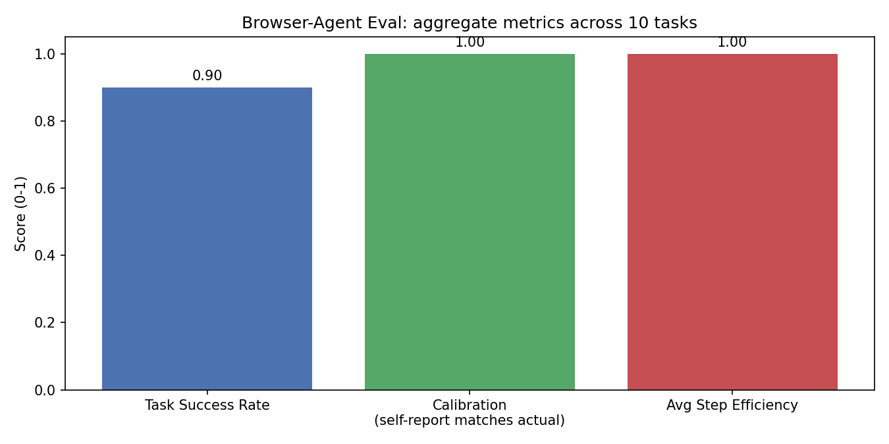

# Browser-Agent Evaluation Harness

A Playwright learning project that grew into a second AI-evaluation portfolio
piece: after learning Playwright fundamentals, I built an evaluation harness
for an AI agent that completes tasks *inside a web app* — clicking, typing,
and navigating — rather than just answering questions in text.

This follows the same evaluation-engineering methodology as my other project,
[rag-eval-project](https://github.com/maneeshaucsc/rag-eval-project), but for
a different kind of AI system: multi-step decision-making instead of text
generation. Together the two projects demonstrate evaluating both major
shapes of modern LLM applications.

## Part 1 — Playwright fundamentals (`lessons/`)

Four short scripts, each isolating one concept:

| Lesson | Concept |
|---|---|
| `01_launch_and_navigate.py` | Browser → Context → Page; navigating |
| `02_locators_and_actions.py` | Finding elements by role (the same way assistive tech — and browser AI agents — perceive a page); auto-waiting |
| `03_assertions.py` | `expect()` — the actual pass/fail mechanism, with built-in retry |
| `04_screenshots_and_trace.py` | Capturing evidence (screenshots, full interactive traces) for debugging failures |

## Part 2 — Browser-agent evaluation harness (`site/`, `agent/`, `tasks_eval/`)

**The system under test:** `site/index.html` — a small, self-contained to-do
list app ("TaskFlow"). Built specifically for this project so the environment
is fully controlled and deterministic (no flaky third-party sites, no rate
limits) — the same reasoning benchmarks like WebArena use self-hosted sandbox
sites.

**The agent:** `agent/run_agent.py` — Claude picks one action per turn via
tool use (`click`, `fill`, or `finish`), using a plain-text description of
the page's interactive elements (`agent/state.py`) as its only view of the
world. Playwright (`agent/actions.py`) executes each action and the resulting
page state is fed back for the next turn. This loop is a minimal version of
how real browser-agent systems work.

**The eval set:** `tasks_eval/tasks.jsonl` — 10 natural-language tasks against
a known starting state, including **one deliberately impossible task**
("mark a task complete that doesn't exist in the list") — the same trick as
the unanswerable questions in the RAG project, testing whether the agent
correctly reports failure instead of fabricating success.

**The metrics** (`tasks_eval/verifiers.py`, `tasks_eval/run_eval.py`):

| Metric | What it measures | How it's computed |
|---|---|---|
| Task Success Rate | Did the app end up in the correct state? | Ground-truth verifier per task, written as Playwright `expect()` assertions |
| Calibration | Does the agent's own self-reported success match the ground truth? | `self_reported_success == actual_success` |
| Step Efficiency | Did the agent solve the task in close to the minimum number of actions? | `min_steps / steps_taken`, capped at 1.0 |
| Invalid Actions | Did the agent try to act on an element that doesn't exist? | Counted whenever an action targets a non-existent element |

Calibration is the interesting one: a system can be *right* by accident, or
*wrong but confident*. Comparing an agent's own self-assessment against ground
truth is a real technique from LLM evaluation (the same idea as confidence
calibration in classifiers), applied here to agent behavior.

## Part 2 results

- **Task success rate: 0.90** (9/10) — every *completable* task succeeded.
  The one "failure" is the impossible task, which the agent correctly
  identified and refused rather than fabricating a completed action.
- **Calibration: 1.00** — the agent's self-reported outcome matched the
  ground-truth verifier on all 10 tasks, including correctly predicting its
  own failure on the impossible one.
- **Avg step efficiency: 1.00** — no wasted actions on any task.
- **Invalid actions: 0** — the agent never tried to act on an element that
  wasn't actually on the page.

Full per-task breakdown: `tasks_eval/reports/AGENT_EVAL_REPORT.md`.



## Part 3 — Swapping in Playwright MCP (`tasks_eval/mcp_agent_lib.py`, `run_eval_mcp.py`)

**MCP (Model Context Protocol)** is the standard way to connect an AI model to
external tools. [Playwright MCP](https://github.com/microsoft/playwright-mcp)
is Microsoft's official MCP server that exposes browser control as tools
(`browser_navigate`, `browser_snapshot`, `browser_click`, `browser_type`, ...)
over a client/server protocol — the production-grade version of the
hand-rolled `agent/actions.py` + `agent/state.py` from Part 2.

To prove this out hands-on before rebuilding anything (see `lessons/mcp_hello.py`
and `lessons/mcp_agent.py`), I connected to the real server, listed its tools,
and called a few directly. One concrete difference from the hand-rolled
version stood out immediately: Playwright MCP locates elements by a **ref**
generated fresh in each `browser_snapshot` call (e.g. `ref=e12`), not by
role+name — so the workflow is *snapshot → act on a ref → snapshot again*,
since refs can change whenever the page re-renders.

**The rebuild:** `tasks_eval/mcp_agent_lib.py` replaces the hand-rolled action
layer entirely. MCP tool schemas are converted directly into Claude's `tools`
format (both use JSON Schema, so this is nearly mechanical) and mixed with one
custom, non-MCP tool (`finish`) — proving a model can use a remote server's
tools and your own tools side by side in the same request.
`tasks_eval/run_eval_mcp.py` runs this MCP-backed agent over the *same* 10
labeled tasks from Part 2, serving the TaskFlow app itself (no manual server
needed) and resetting `localStorage` between tasks. Verification
(`tasks_eval/verifiers_mcp.py`) works on the final `browser_snapshot` text via
pattern matching, since MCP manages its own browser process rather than
handing back a `Page` object.

One real bug surfaced during this: my first verifier for "is this tab
selected" required `[selected]` to appear immediately after the tab name, but
Playwright MCP's snapshot format sometimes inserts an extra `[active]` marker
in between (`tab "Active" [active] [selected] [ref=...]`). That produced two
false "failures" that had nothing to do with the agent — a reminder that a
ground-truth verifier needs the same scrutiny as the system it's grading.

## Part 3 results — hand-rolled vs. Playwright MCP

Same 10 tasks, same model, same app — only the action/perception layer
differs.

| Metric | Hand-rolled actions | Playwright MCP |
|---|---:|---:|
| Task Success Rate | 0.90 | 0.90 |
| Calibration | 1.00 | 1.00 |
| Invalid Actions (total) | 0 | 5 |
| Avg Steps Taken* | 1.9 | 4.9 |


**Finding:** both approaches hit the same 90% success rate and 100%
calibration — the bottleneck was Claude's underlying tool-use behavior, not
which action interface it was given. The real difference is invalid actions:
the MCP agent guessed a wrong `target` format (an element description
instead of a snapshot ref) a few times before self-correcting — something the
hand-rolled schema's simpler role+name interface didn't allow it to get wrong
in the first place. \*Step counts aren't perfectly apples-to-apples: the MCP
agent must explicitly call `browser_snapshot` to see the page (a real,
counted action), while the hand-rolled agent was handed a text description of
the page for free every turn — so its higher step count partly reflects a
more realistic perception cost, not pure inefficiency.

Full report: `tasks_eval/reports/COMPARISON_REPORT.md`.

## Design notes / limitations

- All 10 tasks passed in both versions, which is a clean result but not a
  very demanding test of the harness itself — a stronger version of this
  project would add adversarial or ambiguous tasks (e.g. two similarly-named
  items, a task that requires backtracking) to see where the agent actually
  breaks, the same way the RAG project's top_k comparison surfaced a real
  tradeoff.
- The Part 2 agent's "perception" is a hand-simplified list of interactive
  elements, not the full accessibility tree — good enough for a small app,
  but a real system would need to handle much larger, messier pages. Part 3's
  MCP agent uses the real accessibility snapshot instead.
- The Part 3 verifiers do text-pattern matching against a snapshot string
  rather than direct Playwright `expect()` assertions, since the MCP server
  owns its own browser process. A more robust version would attach Playwright
  MCP to a browser launched via `--cdp-endpoint`, so a separate Playwright
  connection could verify state with the same assertions as Part 2.
- Each task runs against a freshly reset `localStorage`, so results are
  deterministic and comparable across runs and between the two agents.

## Running it

```bash
pip install -r requirements.txt
playwright install chromium
cp .env.example .env   # add your ANTHROPIC_API_KEY
# Also requires Node.js (npx) on PATH for Part 3 (Playwright MCP)

# Part 2 -- hand-rolled agent
python tasks_eval/run_eval.py       # runs the agent on all 10 tasks
python tasks_eval/report.py         # generates the chart + report

# Part 3 -- Playwright MCP agent
python tasks_eval/run_eval_mcp.py   # runs the MCP-backed agent on the same 10 tasks
python tasks_eval/report_compare.py # generates the hand-rolled vs. MCP comparison
```
