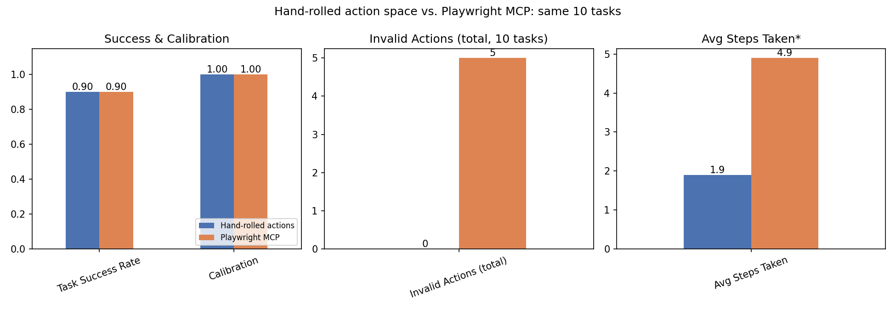

# Hand-Rolled vs. Playwright MCP: Agent Comparison

Same 10 labeled tasks, same Claude model, same TaskFlow app -- only the action/perception layer differs: a small hand-written tool schema (`agent/actions.py` + `agent/state.py`) vs. the real Playwright MCP server.

|                         |   Hand-rolled actions |   Playwright MCP |
|:------------------------|----------------------:|-----------------:|
| Task Success Rate       |                   0.9 |              0.9 |
| Calibration             |                   1   |              1   |
| Invalid Actions (total) |                   0   |              5   |
| Avg Steps Taken         |                   1.9 |              4.9 |

*Step counts aren't perfectly apples-to-apples: the MCP agent must explicitly call `browser_snapshot` to see the page (a real action, counted here), while the hand-rolled agent was handed a text description of the page for free each turn. The MCP agent's higher step count partly reflects that extra, more realistic perception cost.

**Finding:** both approaches hit the same 90% success rate and 100% calibration -- neither the hand-rolled action space nor the standard MCP one was the bottleneck here; Claude's underlying tool-use behavior was the limiting factor either way. The real difference is invalid actions: the MCP agent guessed a wrong `target` format (an element description instead of a snapshot ref) a few times before self-correcting, something the hand-rolled tool schema's simpler role+name interface didn't allow it to get wrong in the first place.